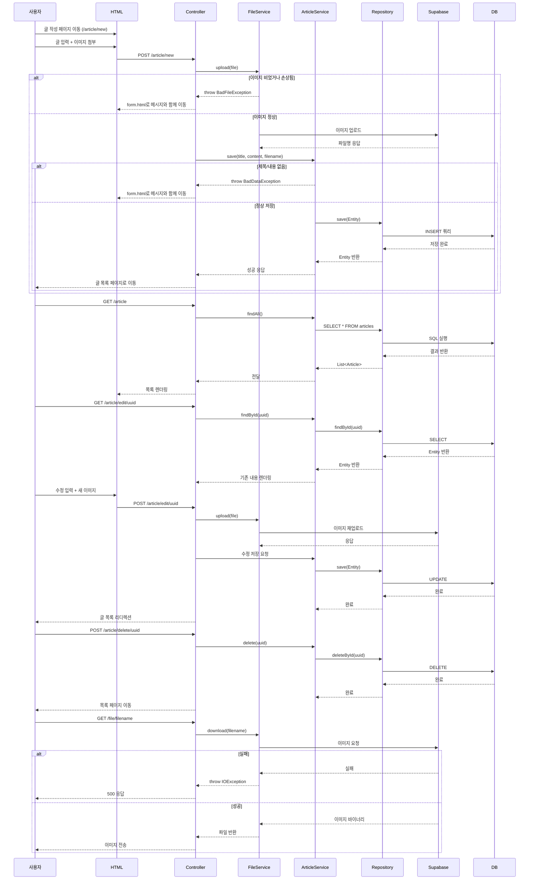

## 전체적인 흐름

```mermaid
sequenceDiagram
    participant 사용자
    participant HTML
    participant Controller
    participant FileService
    participant ArticleService
    participant Repository
    participant Supabase
    participant DB

    %% 글 작성
    사용자->>HTML: 글 작성 페이지 이동 (/article/new)
    사용자->>HTML: 글 입력 + 이미지 첨부
    HTML->>Controller: POST /article/new
    Controller->>FileService: upload(file)
    alt 이미지 비었거나 손상됨
        FileService-->>Controller: throw BadFileException
        Controller-->>HTML: form.html로 메시지와 함께 이동
    else 이미지 정상
        FileService->>Supabase: 이미지 업로드
        Supabase-->>FileService: 파일명 응답
        Controller->>ArticleService: save(title, content, filename)
        alt 제목/내용 없음
            ArticleService-->>Controller: throw BadDataException
            Controller-->>HTML: form.html로 메시지와 함께 이동
        else 정상 저장
            ArticleService->>Repository: save(Entity)
            Repository->>DB: INSERT 쿼리
            DB-->>Repository: 저장 완료
            Repository-->>ArticleService: Entity 반환
            ArticleService-->>Controller: 성공 응답
            Controller-->>사용자: 글 목록 페이지로 이동
        end
    end

    %% 글 목록 조회
    사용자->>Controller: GET /article
    Controller->>ArticleService: findAll()
    ArticleService->>Repository: SELECT * FROM articles
    Repository->>DB: SQL 실행
    DB-->>Repository: 결과 반환
    Repository-->>ArticleService: List<Article>
    ArticleService-->>Controller: 전달
    Controller-->>HTML: 목록 렌더링

    %% 글 수정
    사용자->>Controller: GET /article/edit/uuid
    Controller->>ArticleService: findById(uuid)
    ArticleService->>Repository: findById(uuid)
    Repository->>DB: SELECT
    DB-->>Repository: Entity 반환
    Repository-->>ArticleService: Entity 반환
    ArticleService-->>Controller: 기존 내용 렌더링

    사용자->>HTML: 수정 입력 + 새 이미지
    HTML->>Controller: POST /article/edit/uuid
    Controller->>FileService: upload(file)
    FileService->>Supabase: 이미지 재업로드
    Supabase-->>FileService: 응답
    Controller->>ArticleService: 수정 저장 요청
    ArticleService->>Repository: save(Entity)
    Repository->>DB: UPDATE
    DB-->>Repository: 완료
    Repository-->>ArticleService: 완료
    Controller-->>사용자: 글 목록 리디렉션

    %% 글 삭제
    사용자->>Controller: POST /article/delete/uuid
    Controller->>ArticleService: delete(uuid)
    ArticleService->>Repository: deleteById(uuid)
    Repository->>DB: DELETE
    DB-->>Repository: 완료
    Repository-->>ArticleService: 완료
    Controller-->>사용자: 목록 페이지 이동

    %% 이미지 다운로드
    사용자->>Controller: GET /file/filename
    Controller->>FileService: download(filename)
    FileService->>Supabase: 이미지 요청
    alt 실패
        Supabase-->>FileService: 실패
        FileService-->>Controller: throw IOException
        Controller-->>사용자: 500 응답
    else 성공
        Supabase-->>FileService: 이미지 바이너리
        FileService-->>Controller: 파일 반환
        Controller-->>사용자: 이미지 전송
    end

```
